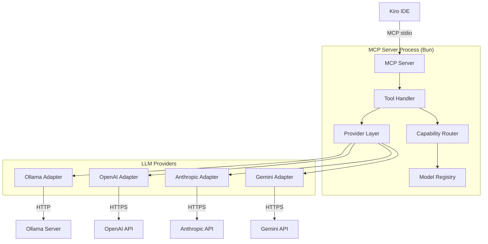
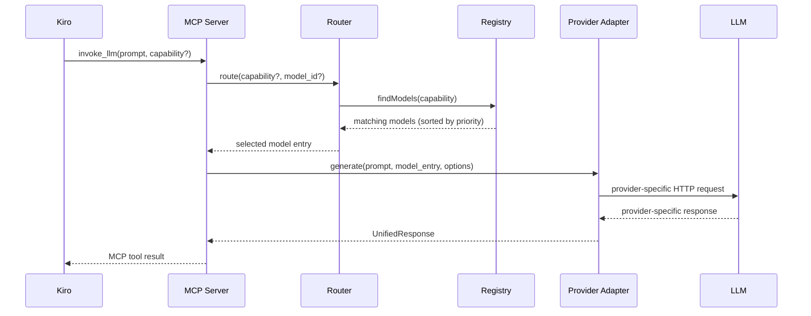
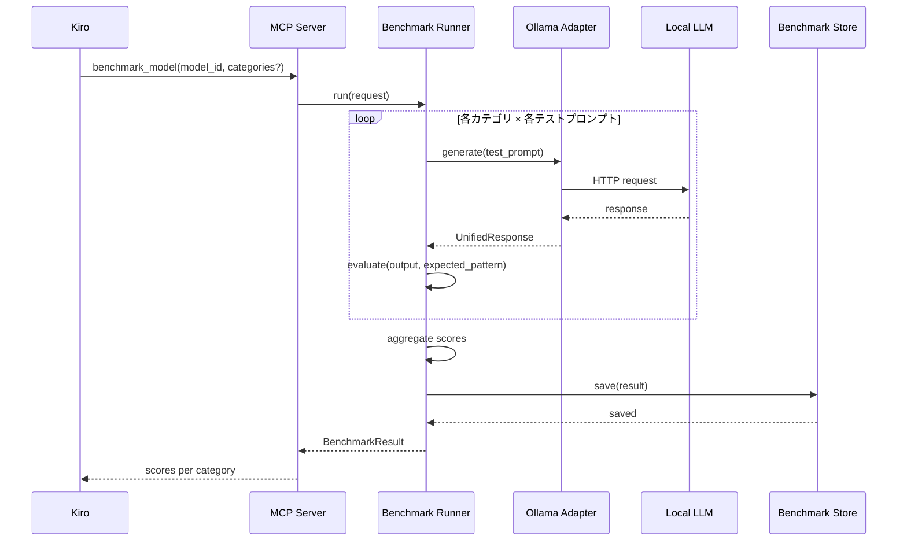
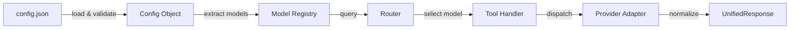

# Design Document: LLM Sub-Agent MCP Server

## Overview

KiroからMCPプロトコル経由でLLMをサブエージェントとして呼び出すためのMCPサーバの設計。Bun runtime上で動作し、Ollama・OpenAI・Anthropic・Google Geminiの4プロバイダに対応する。capability宣言に基づくルーティングにより、タスクに最適なモデルを自動選択する。

### 設計方針

- **軽量・高速**: Bun runtimeの高速起動とネイティブfetch APIを活用
- **プロバイダ抽象化**: 各プロバイダの差異をアダプタパターンで吸収
- **型安全**: TypeScript + Zodによるスキーマバリデーション
- **テスタビリティ**: 純粋関数ベースのルーティングロジックとDI可能なプロバイダ層

### 技術スタック

| 項目 | 選定 |
|------|------|
| Runtime | Bun |
| 言語 | TypeScript |
| MCP SDK | @modelcontextprotocol/sdk |
| バリデーション | Zod |
| トランスポート | stdio |
| テスト | bun:test + fast-check (PBT) |

## Architecture

### システム構成図



### レイヤー構成

```
src/
├── index.ts              # エントリポイント（MCP Server起動）
├── config/
│   ├── schema.ts         # Zodスキーマ定義
│   ├── loader.ts         # Config_File読み込み・バリデーション
│   └── types.ts          # 設定型定義
├── registry/
│   ├── model-registry.ts # Model_Registry実装
│   └── types.ts          # レジストリ型定義
├── router/
│   └── capability-router.ts # Capabilityベースルーティング
├── providers/
│   ├── base.ts           # Provider共通インターフェース
│   ├── ollama.ts         # Ollamaアダプタ
│   ├── openai.ts         # OpenAIアダプタ
│   ├── anthropic.ts      # Anthropicアダプタ
│   └── gemini.ts         # Geminiアダプタ
├── tools/
│   ├── invoke-llm.ts     # invoke_llmツール実装
│   ├── list-models.ts    # list_modelsツール実装
│   ├── health-check.ts   # health_checkツール実装
│   └── benchmark.ts      # benchmark_modelツール実装
├── benchmark/
│   ├── runner.ts          # ベンチマーク実行エンジン
│   ├── prompts.ts         # カテゴリ別テストプロンプト
│   ├── scorer.ts          # スコア算出ロジック
│   └── store.ts           # 結果永続化
└── types/
    └── response.ts       # 統一レスポンス型
```

### リクエストフロー



## Components and Interfaces

### 1. Config Loader

設定ファイルの読み込みとZodスキーマによるバリデーションを担当。

```typescript
// config/schema.ts
import { z } from "zod";

export const ModelEntrySchema = z.object({
  id: z.string().min(1),
  provider: z.enum(["ollama", "openai", "anthropic", "gemini"]),
  endpoint: z.string().url(),
  model_name: z.string().min(1),
  capabilities: z.array(z.string()).min(1),
  priority: z.number().int().min(0).default(0),
  auth: z.object({
    api_key: z.string().optional(),
    env_var: z.string().optional(),
  }).optional(),
  timeout_ms: z.number().int().positive().default(30000),
  scores: z.record(z.string(), z.number().min(0).max(100)).optional(),
  tags: z.array(z.string()).optional(),
});

export const ConfigSchema = z.object({
  models: z.array(ModelEntrySchema).min(1),
  defaults: z.object({
    timeout_ms: z.number().int().positive().default(30000),
  }).optional(),
});

export type Config = z.infer<typeof ConfigSchema>;
export type ModelEntry = z.infer<typeof ModelEntrySchema>;
```

```typescript
// config/loader.ts
export interface ConfigLoader {
  load(path: string): Promise<Config>;
}
```

### 2. Model Registry

バリデーション済みのModel_Entryを保持し、検索機能を提供。

```typescript
// registry/model-registry.ts
export interface ModelRegistry {
  /** 全モデルエントリ取得 */
  getAll(): ModelEntry[];
  
  /** ID指定で取得 */
  getById(id: string): ModelEntry | undefined;
  
  /** capability指定で検索（priority降順） */
  findByCapability(capability: string): ModelEntry[];
  
  /** priority最高のモデル取得 */
  getDefault(): ModelEntry;
}
```

### 3. Capability Router

リクエストパラメータに基づきモデルを選択するルーティングロジック。

```typescript
// router/capability-router.ts
export interface RouteRequest {
  capability?: string;
  model_id?: string;
}

export interface RouteResult {
  success: true;
  model: ModelEntry;
} | {
  success: false;
  error: string;
}

export interface CapabilityRouter {
  route(request: RouteRequest): RouteResult;
}
```

ルーティング優先順位:
1. `model_id`指定あり → 該当モデルへ直接転送
2. `capability`指定あり → 該当capabilityを持つモデルのうち、スコア付きモデルはスコア×priority、スコアなしモデルはpriorityのみで比較し最高値を選択
3. 両方なし → デフォルトモデル（全モデル中priority最高）を選択

#### スコアベースルーティング詳細

capability指定ルーティング時のモデル選択スコア算出:

```typescript
function computeEffectivePriority(model: ModelEntry, capability: string): number {
  const baseScore = model.priority;
  const benchmarkScore = model.scores?.[capability]; // 0-100 or undefined
  if (benchmarkScore !== undefined) {
    // スコアを0-1に正規化してpriorityに乗算
    return baseScore * (1 + benchmarkScore / 100);
  }
  return baseScore;
}
```

- ベンチマークスコアが存在するモデル: `priority × (1 + score/100)` で実効priority算出
- スコアなしモデル（クラウドAPI等）: `priority`値をそのまま使用
- 同一実効priorityの場合: model_idの辞書順で決定論的に選択

### 4. Provider Interface

各LLMプロバイダへのリクエスト送信を抽象化するインターフェース。

```typescript
// providers/base.ts
export interface GenerateRequest {
  prompt: string;
  model_name: string;
  endpoint: string;
  auth?: { api_key?: string };
  options?: {
    temperature?: number;
    max_tokens?: number;
    system_prompt?: string;
  };
  timeout_ms: number;
}

export interface ProviderAdapter {
  readonly provider: string;
  generate(request: GenerateRequest): Promise<UnifiedResponse>;
  healthCheck(entry: ModelEntry): Promise<HealthStatus>;
}
```

### 5. Unified Response

全プロバイダのレスポンスを統一するフォーマット。

```typescript
// types/response.ts
export interface UnifiedResponse {
  text: string;
  model_id: string;
  provider: string;
  usage: {
    prompt_tokens?: number;
    completion_tokens?: number;
    total_tokens?: number;
  };
}

export interface HealthStatus {
  model_id: string;
  provider: string;
  reachable: boolean;
  latency_ms?: number;
  error?: string;
}

export interface ErrorResponse {
  error: true;
  error_type: "routing" | "provider" | "timeout" | "config";
  message: string;
  model_id?: string;
  provider?: string;
}
```

### 6. MCP Tool Definitions

```typescript
// tools/invoke-llm.ts
export const invokeLlmSchema = {
  prompt: z.string().min(1),
  capability: z.string().optional(),
  model_id: z.string().optional(),
  options: z.object({
    temperature: z.number().min(0).max(2).optional(),
    max_tokens: z.number().int().positive().optional(),
    system_prompt: z.string().optional(),
  }).optional(),
};
```

### 7. Benchmark Engine

ローカルLLMの性能を事前測定し、capabilityごとのスコアを算出するコンポーネント。

```typescript
// benchmark/runner.ts
export interface BenchmarkRequest {
  model_id: string;
  categories?: string[]; // 未指定時は全カテゴリ
}

export interface CategoryResult {
  category: string;
  score: number;          // 0-100
  avg_latency_ms: number;
  prompts_tested: number;
  details: PromptResult[];
}

export interface PromptResult {
  prompt: string;
  expected_pattern: string; // 期待出力のパターン（正規表現）
  actual_output: string;
  score: number;           // 0-100
  latency_ms: number;
}

export interface BenchmarkResult {
  model_id: string;
  timestamp: string;       // ISO 8601
  categories: CategoryResult[];
  scores: Record<string, number>; // capability → score (0-100)
}

export interface BenchmarkRunner {
  /** ベンチマーク実行（"no-benchmark"タグ付きモデルは拒否） */
  run(request: BenchmarkRequest): Promise<BenchmarkResult>;
  /** モデルがベンチマーク対象か判定 */
  isBenchmarkable(entry: ModelEntry): boolean;
}
```

```typescript
// benchmark/prompts.ts
export interface TestPrompt {
  category: string;
  prompt: string;
  expected_pattern: string;  // 正規表現で出力品質を判定
  weight: number;            // スコア計算時の重み
}

// 各カテゴリ3-5個のテストプロンプトを定義
export const TEST_PROMPTS: TestPrompt[] = [
  // code_generation: FizzBuzz、ソート、型定義等
  // reasoning: 論理パズル、数学問題等
  // summarization: テキスト要約タスク
  // translation: 日英翻訳タスク
  // chat: 対話応答タスク
];
```

```typescript
// benchmark/scorer.ts
export interface Scorer {
  /** 出力がexpected_patternにマッチするか判定しスコア算出 */
  evaluate(output: string, expectedPattern: string): number;
}
```

```typescript
// benchmark/store.ts
export interface BenchmarkStore {
  /** 結果をbenchmark-results.jsonに保存 */
  save(result: BenchmarkResult): Promise<void>;
  /** 保存済み結果を読み込み */
  load(modelId: string): Promise<BenchmarkResult | undefined>;
  /** 全結果読み込み */
  loadAll(): Promise<BenchmarkResult[]>;
}
```

#### ベンチマーク実行フロー



## Data Models

### Config File構造

```json
{
  "models": [
    {
      "id": "local-codegen",
      "provider": "ollama",
      "endpoint": "http://localhost:11434",
      "model_name": "codellama:13b",
      "capabilities": ["code_generation", "reasoning"],
      "priority": 10,
      "timeout_ms": 60000,
      "scores": {
        "code_generation": 78,
        "reasoning": 45
      }
    },
    {
      "id": "cloud-gpt4",
      "provider": "openai",
      "endpoint": "https://api.openai.com/v1",
      "model_name": "gpt-4o",
      "capabilities": ["code_generation", "reasoning", "summarization"],
      "priority": 5,
      "auth": {
        "env_var": "OPENAI_API_KEY"
      },
      "timeout_ms": 30000,
      "tags": ["no-benchmark"]
    },
    {
      "id": "cloud-claude",
      "provider": "anthropic",
      "endpoint": "https://api.anthropic.com",
      "model_name": "claude-sonnet-4-20250514",
      "capabilities": ["reasoning", "summarization", "translation"],
      "priority": 8,
      "auth": {
        "env_var": "ANTHROPIC_API_KEY"
      }
    },
    {
      "id": "cloud-gemini",
      "provider": "gemini",
      "endpoint": "https://generativelanguage.googleapis.com/v1beta",
      "model_name": "gemini-2.5-flash",
      "capabilities": ["summarization", "translation", "chat"],
      "priority": 6,
      "auth": {
        "env_var": "GOOGLE_API_KEY"
      }
    }
  ],
  "defaults": {
    "timeout_ms": 30000
  }
}
```

### プロバイダ別APIマッピング

| Provider | Endpoint Pattern | Auth Header |
|----------|-----------------|-------------|
| Ollama | `{endpoint}/api/chat` | なし |
| OpenAI | `{endpoint}/chat/completions` | `Authorization: Bearer {key}` |
| Anthropic | `{endpoint}/v1/messages` | `x-api-key: {key}` |
| Gemini | `{endpoint}/models/{model}:generateContent?key={key}` | URLパラメータ |

### 内部データフロー




## Correctness Properties

*プロパティとは、システムの全ての有効な実行において成立すべき特性や振る舞い——すなわち、システムが何をすべきかについての形式的な記述。人間が読める仕様と機械が検証可能な正しさの保証を橋渡しする。*

### Property 1: Config読み込みでエントリ数保存

*For any* 有効なConfig_Fileオブジェクト（重複IDなし）に対して、Model_Registryに読み込んだ後のエントリ数は、Config_File内のmodels配列の長さと等しい

**Validates: Requirements 1.1**

### Property 2: 重複ID検出・除外

*For any* Model_Entryリストにおいて、同一IDのエントリが複数存在する場合、Registry構築後のエントリ数は一意なIDの数と等しく、重複IDのエントリは最初の1つのみ保持される

**Validates: Requirements 1.4**

### Property 3: Capabilityルーティングは実効priority最高のモデルを選択

*For any* Model_Entryセットと任意のcapability文字列に対して、該当capabilityを持つモデルが1つ以上存在する場合、ルーティング結果のモデルは(a)指定capabilityを持ち、かつ(b)同一capabilityを持つ全モデルの中で実効priority（scores存在時: priority × (1 + score/100)、scores未存在時: priority）が最大である

**Validates: Requirements 2.2, 2.3, 8.5**

### Property 4: 存在しないcapabilityでエラー

*For any* Model_Entryセットと任意のcapability文字列に対して、該当capabilityを持つモデルが存在しない場合、ルーティング結果はエラーレスポンスとなる

**Validates: Requirements 2.4**

### Property 5: model_id指定で直接転送

*For any* Model_Entryセットにおいて、登録済みのmodel_idを指定してルーティングした場合、結果は必ず該当IDのモデルであり、capability指定は無視される

**Validates: Requirements 2.5**

### Property 6: デフォルトモデルはpriority最高

*For any* Model_Entryセットに対して、capabilityもmodel_idも指定せずにルーティングした場合、選択されるモデルは全モデル中でpriority値が最大のものである

**Validates: Requirements 4.4**

### Property 7: 認証情報解決

*For any* Model_Entryの認証設定に対して、(a) api_key直接指定がある場合はその値を返し、(b) env_var指定がある場合は対応する環境変数の値を返し、(c) どちらもない場合はundefinedを返す

**Validates: Requirements 3.5**

### Property 8: レスポンス正規化で必須フィールド保持

*For any* プロバイダ固有のレスポンスオブジェクトに対して、正規化後のUnifiedResponseは必ずtext（文字列）、model_id（文字列）、provider（文字列）、usage（オブジェクト）フィールドを含む

**Validates: Requirements 5.1**

### Property 9: ストリーミングチャンク結合

*For any* テキストチャンクの配列に対して、ストリーミング結合関数の出力は全チャンクを順序通りに連結した文字列と等しい

**Validates: Requirements 5.2**

### Property 10: バリデーションエラーに箇所情報含む

*For any* 無効なConfig_Fileオブジェクトに対して、バリデーションエラーメッセージはエラーが発生したフィールドパス情報を含む

**Validates: Requirements 7.3**

### Property 11: Config_Fileラウンドトリップ

*For any* 有効なConfigオブジェクトに対して、JSON.stringifyでシリアライズし、JSON.parseでパースし、スキーマバリデーションを通した結果は元のオブジェクトと等価である

**Validates: Requirements 7.4**

### Property 12: ベンチマークスコア範囲

*For any* ベンチマーク実行結果に対して、各カテゴリのスコアは0以上100以下の整数であり、結果のscoresオブジェクトのキーはベンチマーク対象カテゴリと一致する

**Validates: Requirements 8.3**

### Property 13: ベンチマーク結果永続化のラウンドトリップ

*For any* BenchmarkResultオブジェクトに対して、benchmark-results.jsonに保存し再読み込みした結果は元のオブジェクトと等価である

**Validates: Requirements 8.8**

### Property 14: スコア付きルーティングの単調性

*For any* 2つのModel_Entry（同一capability、同一priority）に対して、一方のスコアが他方より高い場合、スコアが高いモデルが常に選択される

**Validates: Requirements 8.5**

### Property 15: no-benchmarkタグによるベンチマーク除外

*For any* Model_Entryに対して、tagsに"no-benchmark"が含まれる場合、isBenchmarkable()はfalseを返し、benchmark_modelツールはエラーレスポンスを返却する

**Validates: Requirements 8.7**

## Error Handling

### エラー分類

| エラー種別 | 発生箇所 | 対応 |
|-----------|---------|------|
| `config` | Config_File読み込み・バリデーション | 起動中止、エラーメッセージ出力 |
| `routing` | Capability Router | 構造化エラーレスポンス返却 |
| `provider` | Provider Adapter | 構造化エラーレスポンス返却 |
| `timeout` | Provider Adapter | タイムアウト後にエラーレスポンス返却 |
| `benchmark` | Benchmark Runner | 構造化エラーレスポンス返却（到達不能等） |

### エラーレスポンス構造

```typescript
interface ErrorResponse {
  error: true;
  error_type: "routing" | "provider" | "timeout" | "config" | "benchmark";
  message: string;
  model_id?: string;
  provider?: string;
}
```

### エラーハンドリング方針

1. **起動時エラー（config）**: プロセス終了コード1で終了。stderr にエラー詳細を出力
2. **ルーティングエラー**: MCPツール結果としてErrorResponseを返却。Kiro側でユーザーに通知
3. **プロバイダエラー**: HTTP応答のステータスコードとボディからエラー種別を判定し構造化
4. **タイムアウト**: AbortControllerによるリクエストキャンセル。timeout_ms経過後にエラー返却
5. **予期しないエラー**: try-catchで捕捉し、汎用エラーレスポンスとして返却

### 認証エラーの特別処理

- 401/403レスポンス → `error_type: "provider"`, message に認証設定の確認を促すヒント含む
- env_var指定で環境変数が未設定 → 起動時に警告ログ出力（起動は継続）

## Testing Strategy

### テスト構成

```
tests/
├── unit/
│   ├── config/
│   │   ├── schema.test.ts        # スキーマバリデーション
│   │   └── loader.test.ts        # Config読み込み
│   ├── registry/
│   │   └── model-registry.test.ts # Registry操作
│   ├── router/
│   │   └── capability-router.test.ts # ルーティングロジック
│   └── providers/
│       ├── ollama.test.ts         # Ollamaレスポンス正規化
│       ├── openai.test.ts         # OpenAIレスポンス正規化
│       ├── anthropic.test.ts      # Anthropicレスポンス正規化
│       └── gemini.test.ts         # Geminiレスポンス正規化
├── property/
│   ├── config-roundtrip.prop.ts   # Property 11: ラウンドトリップ
│   ├── registry.prop.ts          # Property 1, 2: Registry不変条件
│   ├── routing.prop.ts           # Property 3, 4, 5, 6, 14: ルーティング
│   ├── auth-resolver.prop.ts     # Property 7: 認証解決
│   ├── response.prop.ts          # Property 8, 9: レスポンス正規化
│   ├── validation-errors.prop.ts # Property 10: エラーメッセージ
│   └── benchmark.prop.ts         # Property 12, 13: ベンチマーク
└── integration/
    ├── mcp-server.test.ts         # MCPプロトコル通信
    └── providers/                 # 実プロバイダ接続（CI除外）
```

### Property-Based Testing

- **ライブラリ**: [fast-check](https://github.com/dubzzz/fast-check)
- **実行回数**: 各プロパティテスト最低100イテレーション
- **タグ形式**: `Feature: llm-sub-agent-mcp-server, Property {number}: {property_text}`
- **各Correctness Propertyに対して1つのプロパティテストを実装**

### ユニットテスト

- 各プロバイダのレスポンス正規化（具体的なAPIレスポンス例）
- エラーケース（不正入力、ネットワークエラー模擬）
- 境界値（空配列、最大長文字列、特殊文字）

### 統合テスト

- MCPプロトコル経由でのツール呼び出し
- stdioトランスポートでの通信
- 起動時間計測（500ms以内）

### テスト実行

```bash
# 全テスト実行
bun test

# プロパティテストのみ
bun test tests/property/

# ユニットテストのみ
bun test tests/unit/

# 統合テスト（ローカルOllama必要）
bun test tests/integration/
```
